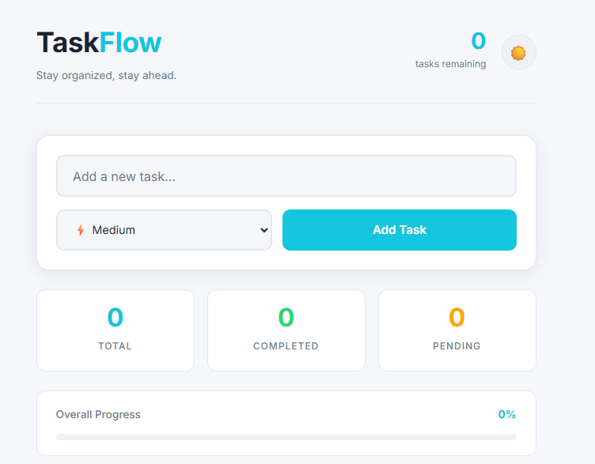
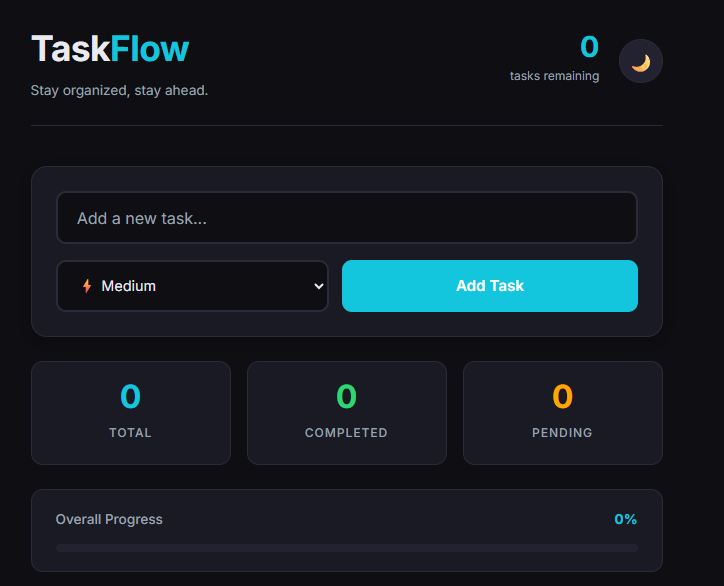

[README_P3.md](https://github.com/user-attachments/files/28876264/README_P3.md)
# ⚡ TaskFlow — Smart Task Manager

> **Project 3 of 3** | DecodeLabs Frontend Development Internship — Batch 2026

A fully interactive, feature-rich task management application built with Vanilla JavaScript. Demonstrates complete mastery of DOM manipulation, state management, event handling, and localStorage persistence — with a beautiful dark/light mode toggle.

---

## 🌐 Live Demo

🔗 **[View Live Site](https://msaim-dev.github.io/3-Task-Manager/)**

---

## 📸 Preview

### Light Mode


### Dark Mode


---

## ✨ Features

- **Add Tasks** — with title and priority level (High / Medium / Low)
- **Complete Tasks** — click checkbox to mark done with strikethrough animation
- **Delete Tasks** — smooth slide-out animation on deletion
- **Filter Tasks** — view All / Active / Completed tasks
- **Live Stats Dashboard** — Total, Completed and Pending counters update in real time
- **Progress Bar** — animated percentage bar showing overall completion
- **Dark / Light Mode** — smooth theme toggle with localStorage persistence
- **localStorage** — all tasks and theme preference saved across page refreshes
- **Enter Key Support** — press Enter to add task without clicking button
- **Empty State** — friendly message when no tasks exist
- **Input Validation** — red border flash when trying to add empty task
- **Responsive Design** — works on all screen sizes
- **W3C Validated** — zero errors, zero warnings

---

## 🛠️ Tech Stack

| Technology | Purpose |
|------------|---------|
| HTML5 | Semantic structure |
| CSS3 | Styling, theming, animations |
| Vanilla JavaScript | DOM manipulation, logic |
| localStorage | Data persistence |
| CSS Custom Properties | Dynamic theme switching |

---

## 📐 JavaScript Architecture

### IPO Loop (Input → Process → Output)
Every feature follows this pattern from engineering fundamentals:

```
INPUT    → User clicks "Add Task"
PROCESS  → JavaScript validates and creates task object
OUTPUT   → DOM updates with new task card rendered
```

### State Management
```javascript
const state = {
    tasks: [],           // array of all task objects
    currentFilter: 'all' // current active filter
};
```

### Key Functions
```
addTask()       → validates input, creates task object, updates state
render()        → reads state, builds DOM, shows/hides empty state
completeTask()  → toggles task.completed boolean
deleteTask()    → animates removal then filters from state
setFilter()     → updates currentFilter, moves is-active class
toggleTheme()   → switches data-theme attribute on <html>
updateCounter() → calculates stats and progress percentage
```

---

## 🎨 Theme System

```css
/* Light Mode */
[data-theme="light"] {
    --bg:      #F5F7FA;
    --surface: #FFFFFF;
    --accent:  #13C5DD;
}

/* Dark Mode */
[data-theme="dark"] {
    --bg:      #0F0F13;
    --surface: #1A1A24;
    --accent:  #13C5DD;
}
```

JavaScript toggles `data-theme` on `<html>` → CSS variables switch automatically across entire app.

---

## 🔧 Engineering Standards Applied

- **`js-` prefix** — classes used only as JavaScript hooks, never styled
- **`is-` prefix** — classes that define visual state (`is-active`, `is-completed`)
- **`const` by default** — `let` only when value must change, never `var`
- **`textContent`** — never `innerHTML` for safe data injection
- **Event Delegation** — one listener on parent catches all child clicks
- **Decoupling** — JavaScript handles behavior, CSS handles visuals

---

## 📁 Project Structure

```
task-manager/
├── index.html
├── css/
│   └── style.css
└── js/
    └── main.js
```

---

## 🚀 Run Locally

```bash
# Clone the repository
git clone https://github.com/msaim-dev/3-Task-Manager.git

# Open in browser
# Open index.html in any modern browser
# No build tools or dependencies required
```

---

## ✅ Quality Checklist

- [x] Buttons and toggles throughout
- [x] User interaction — clicks, keyboard events
- [x] Dynamic content update — real time rendering
- [x] DOM manipulation — createElement, appendChild
- [x] State management — central state object
- [x] localStorage — data persists on refresh
- [x] Dark/Light mode toggle
- [x] Progress bar with live percentage
- [x] Stats dashboard
- [x] W3C Validation — zero errors

---

## 🧠 What I Learned

- How the DOM works as a living tree of objects
- How to select and manipulate DOM elements with querySelector
- How to attach and handle events with addEventListener
- How to manage application state with a central state object
- How JavaScript array methods work — filter, find, forEach, unshift
- How to use template literals to generate HTML dynamically
- How localStorage saves and retrieves data across sessions
- How CSS data-attributes enable dynamic theming
- The IPO (Input → Process → Output) engineering loop
- How to decouple JavaScript logic from CSS presentation
- Event delegation for efficient event handling

---

## 👨‍💻 Built By

**Muhammad Saim** — Frontend Development Intern at DecodeLabs
